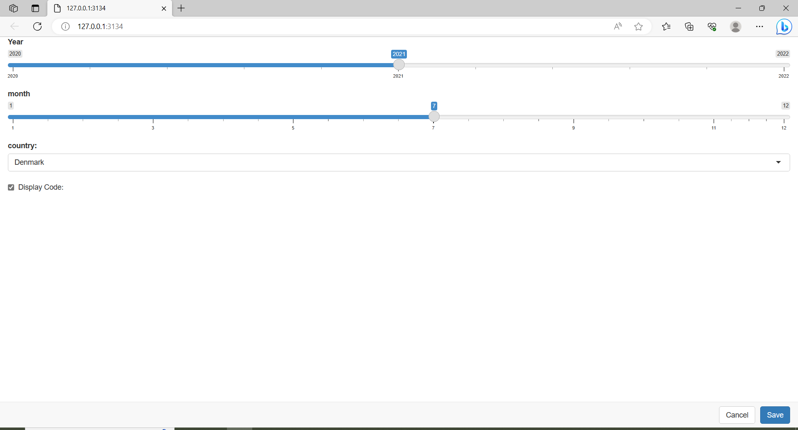

# Params
```{r , include=FALSE}
knitr::opts_chunk$set(echo = TRUE)

```
In this chapter we are going to make a rmarkdown with some parameters
after adding our params we have the next html file in this we will show the covid cases and deaths of croatia of august 2021
```{r}
#make screenshot of parameterized Rmarkdown
webshot::webshot("data/portfolio_opdracht9.html", "data/portfolio_opdracht9.png")
```


next we can render this rmarkdown in two ways 
with the first way we can render the new file by setting the params like so
```{r , eval=FALSE}
#rmarkdown::render("~/Rschool/dsfb2_workflows_portfolio/portfolio_opdracht9.Rmd", params = list(country = "Denmark", year = 2021, month = 8), output_file = "denmark_8_2021")
```

the second way is to replace the params with ask

```{r, eval=FALSE}
#rmarkdown::render("~/Rschool/dsfb2_workflows_portfolio/portfolio_opdracht9.Rmd", params = "ask", output_file = "denmark_8_2021_params_ask")
```
this will open a webpage with sliders and a list of country's


```{r}
webshot::webshot("data/denmark_8_2021_params_ask.html", "data/denmark_8_2021_params_ask.png")
```
after looking at the graphs in the new markdown you can see the data has changed arcorindgly to the given params

